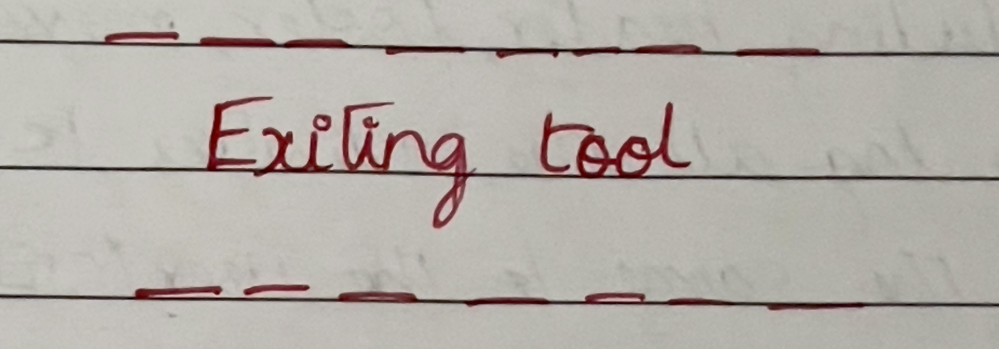
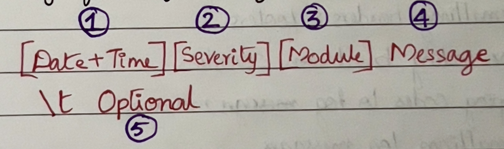
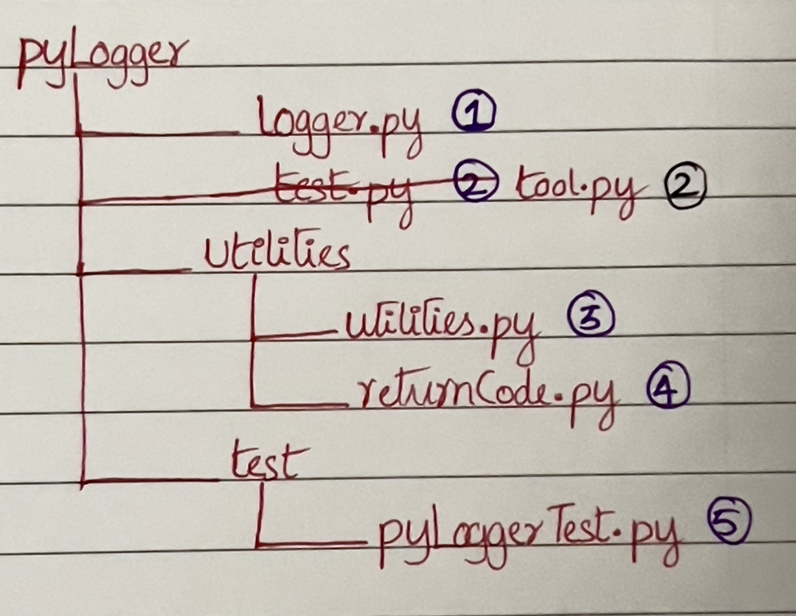

# Objectives

To handle all the logging requirements of a tool, including its header, footer, messages & gracious exit

To log all the activities to a log file and to (optionally) print the same to the user (STDOUT)

---

# Recommended Operations

1. Gathering tool name, current version & identifier/tagline from the user
2. Initializing log file(s)
3. Formatting header & footer
4. Color coding based on severities
5. Mapping codes to log messages
6. Formatting the log messages
7. Logging the messages to a log file
8. Printing the messages to STDOUT
9. Exiting the tool

---

# Anatomy of the Header

- Tool → str → macro → name of the tool
- ver → str → macro → (optional) current version of the tool
- tag → str → macro → (optional) identifier/tag line

---

# Anatomy of the Footer

- Exiting → str → macro
- tool → str → macro → name of the tool

---

# Anatomy of a Log Message

1. Current date & time
2. Severity of the log → PASS, FAIL, INFO, WARN → color coded
3. Name of the location/module where the log originated from
4. Log message to be logged (gathered from RETURN_MSGS dictionary)
5. Optional message to logged (user-specified)

---

# File Structure

1. Contains ‘class Logger’, their associated data members, member functions and their definitions
2. Contains TOOLS, VER & TAG macros (to be edited by user)
3. Contains commonly used macros, color maps & functions
4. Contains RETURN_MSGS dictionary that maps code to messages
5. Contains test script to test pyLogger

---

# pyLogger

## *tool.py*

Contains macros that aid in formatting header & footer of the tool

Edit the macros as needed, on per-tool basis

| Name | Type | Mandatory/Optional |
|------|------|--------------------|
| TOOL | str  | Mandatory          |
| VER  | str  | Optional           |
| TAG  | str  | Optional           |

---

## *logger.py*

### class Logger

***Data Members***

1. logFile
2. verbose

***Member Functions***

1. __init__ ( )
2. Header ( )
3. Footer ( )
4. Log ( )

### Functions

1. ***__init__ ( )***

   Instantiates a new object of class Logger.

   Args

   | Name    | Type | Mandatory/Optional | Default | Description                                                           |
   |---------|------|--------------------|---------|-----------------------------------------------------------------------|
   | logFile | str  | Mandatory          |         | Name of the log file                                                  |
   | verbose | bool | Optional           | False   | Flag indicating whether or not to print all the logs to user (STDOUT) |
2. ***Header ( )***

   Formats header line based on tool.py and logs it.

   Args → None

   Returns → None

3. ***Footer ( )***

   Formats header line based on tool.py and logs it.

   Args → None

   Returns → None

4. ***Log ( )***

   Formats the log message based on the given args, logs it into the object’s log file and optionally print the same to user (STDOUT).

   Args

   | Name     | Type | Mandatory/Optional | Default | Description                                                              |
   |----------|------|--------------------|---------|--------------------------------------------------------------------------|
   | severity | str  | Mandatory          |         | Severity or nature of the current log                                    |
   | module   | str  | Mandatory          |         | Name indicating the location of the current log                          |
   | code     | int  | Mandatory          |         | Integer code with which to fetch the log message                         |
   | optional | str  | Optional           | “”      | Optional message, specified by the user, to be logged                    |
   | user     | bool | optional           | False   | Flag indicating whether or not to print the current log to user (STDOUT) |

   Returns → None

---

## *utilities.py*

### Macros

1. Color Macros

   RED, GRN, BLU, YEL, MAG, CYN

2. Severity Macros

   PASS/FAIL/INFO/WARN

3. Color Map

   Dictionary mapping color to severity

### Functions

1. ***GetCurrentTime ( )***

   Gets and returns the current time in the DD-MM-YYYY HH:MM:SS format.

   Args → None

   Returns

   | Name        | Type | Success                                        | Failure |
   |-------------|------|------------------------------------------------|---------|
   | currentTime | str  | current time in the DD-MM-YYYY HH:MM:SS format | None    |

---